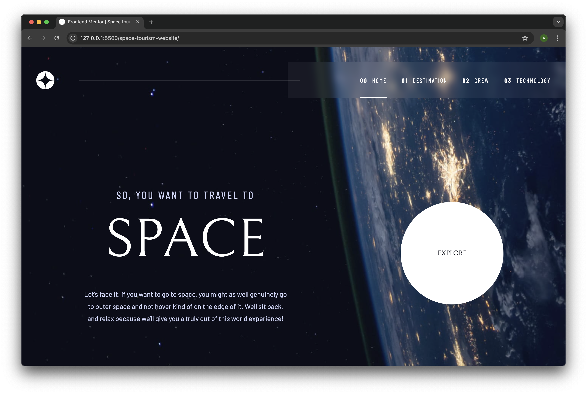

# Frontend Mentor - Space Tourism Website 🚀

This is my solution to the [Space Tourism multi-page website challenge](https://www.frontendmentor.io/challenges/space-tourism-multipage-website-gRWj1URZ3) on Frontend Mentor. It was a great practice for building responsive multi-page layouts and implementing tabbed navigation with JavaScript.

## 🔗 Live Preview

- [Live Site URL](https://your-deployment-link.com)
- [Frontend Mentor Submission](https://www.frontendmentor.io/solutions/your-solution-url)

## 🖼️ Screenshot



## ✅ Features

- Responsive design for mobile, tablet, and desktop
- Tabbed content switching (Destination, Crew, Technology)
- Semantic HTML structure
- Custom JavaScript to manage tab switching and page content
- Styled with CSS using Flexbox

## 🛠️ Built With

- HTML5
- CSS3 (Mobile-first, Flexbox)
- JavaScript (Vanilla)
- Live Server (for local development)

## 📚 What I Learned

This project helped me strengthen the following skills:

- Designing fully responsive layouts with media queries
- Implementing tabbed interfaces using JavaScript DOM manipulation
- Managing project structure and image assets across multiple screen sizes
- Debugging layout issues in mobile/tablet views

```js
  // Example of tab switching
  document.querySelector('.destination-tabs').addEventListener("click", (e) => {
    if (!e.target.closest('a')) {
      return;
    }

    e.preventDefault();
    updateDestination(e.target.dataset.planet);
  });
```

## 🔄 Continued Development

I want to continue improving my CSS layout skills, especially in:

- Better handling of image scaling
- Avoiding layout shifts during screen resizing
- Using BEM naming convention or utility-first frameworks (e.g., Tailwind) in future projects

## 🔗 Useful Resources

- [Kevin Powell’s Space Travel Course on Scrimba](https://scrimba.com/learn/spacetravel)
- [MDN Web Docs](https://developer.mozilla.org/)
- [CSS Tricks](https://css-tricks.com/)
- [The Odin Project](https://www.theodinproject.com/) – for foundational learning

## 👤 Author

- GitHub: [@Alfie](https://github.com/lyfu19)
- Frontend Mentor: [@Alfie](https://www.frontendmentor.io/profile/lyfu19)

## 🙏 Acknowledgments

Thanks to Frontend Mentor for the challenge and Kevin Powell for the helpful course. This project was great for solidifying responsive layout skills.
